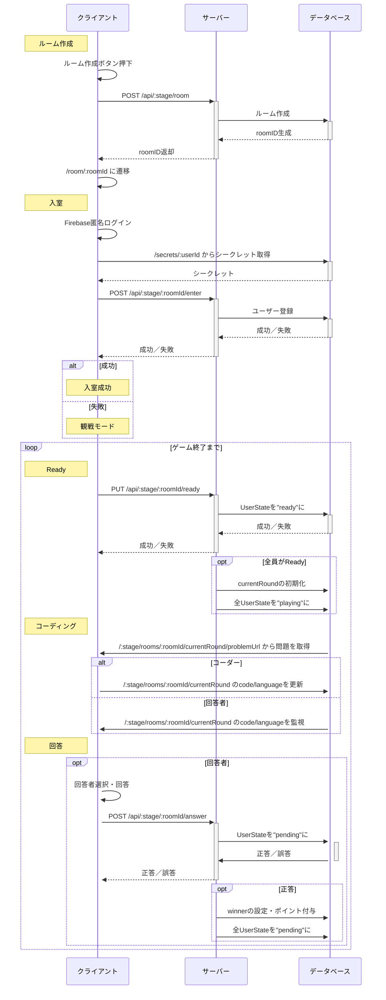

# シーケンス図

```mermaid
sequenceDiagram
  # エイリアス
  participant cl as クライアント
  participant sv as サーバー
  participant db as データベース

  # ルーム作成
  Note left of cl: ルーム作成
  cl ->> cl: ルーム作成ボタン押下
  cl ->>+ sv: POST /api/:stage/room
  sv ->>+ db: ルーム作成
  db -->>- sv: roomID生成
  sv -->>- cl: roomID返却
  cl ->> cl: /room/:roomId に遷移

  # 入室
  Note left of cl: 入室
  cl ->> cl: Firebase匿名ログイン
  cl ->>+ db: /secrets/:userId からシークレット取得
  db -->>- cl: シークレット
  cl ->>+ sv: POST /api/:stage/:roomId/enter
  sv ->>+ db: ユーザー登録
  db -->>- sv: 成功／失敗
  sv -->>- cl: 成功／失敗

  alt 成功
    Note over cl : 入室成功
  else 失敗
    Note over cl : 観戦モード
  end

  loop ゲーム終了まで
    # Ready
    Note left of cl: Ready
    cl ->>+ sv: PUT /api/:stage/:roomId/ready
    sv ->>+ db: UserStateを"ready"に
    db -->>- sv: 成功／失敗
    sv -->>- cl: 成功／失敗
    opt 全員がReady
      sv ->>+ db: currentRoundの初期化
      sv ->>+ db: 全UserStateを"playing"に
    end

    # コーディング
    Note left of cl: コーディング
    db ->>+ cl: /:stage/rooms/:roomId/currentRound/problemUrl から問題を取得
    alt コーダー
      cl ->>+ db: /:stage/rooms/:roomId/currentRound のcode/languageを更新
    else 回答者
      db ->>+ cl: /:stage/rooms/:roomId/currentRound のcode/languageを監視
    end

    # 回答
    Note left of cl: 回答
    opt 回答者
      cl ->> cl: 回答者選択・回答
      cl ->>+ sv: POST /api/:stage/:roomId/answer
      sv ->>+ db: UserStateを"pending"に
      db ->>- sv: 正答／誤答
      sv -->>- cl: 正答／誤答

      opt 正答
        sv ->>+ db: winnerの設定・ポイント付与
        sv ->>+ db: 全UserStateを"pending"に
      end
    end
  end
```