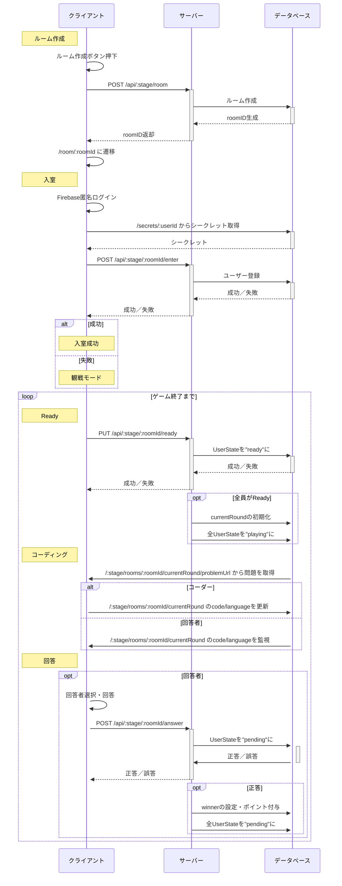

# シーケンス図

![](https://mermaid.ink/img/eyJjb2RlIjoic2VxdWVuY2VEaWFncmFtXG4gICMg44Ko44Kk44Oq44Ki44K5XG4gIHBhcnRpY2lwYW50IGNsIGFzIOOCr-ODqeOCpOOCouODs-ODiFxuICBwYXJ0aWNpcGFudCBzdiBhcyDjgrXjg7zjg5Djg7xcbiAgcGFydGljaXBhbnQgZGIgYXMg44OH44O844K_44OZ44O844K5XG4gICMg44Or44O844Og5L2c5oiQXG4gIE5vdGUgbGVmdCBvZiBjbDog44Or44O844Og5L2c5oiQXG4gIGNsIC0-PiBjbDog44Or44O844Og5L2c5oiQ44Oc44K_44Oz5oq85LiLXG4gIGNsIC0-Pisgc3Y6IFBPU1QgL2FwaS86c3RhZ2Uvcm9vbVxuICBzdiAtPj4rIGRiOiDjg6vjg7zjg6DkvZzmiJBcbiAgZGIgLS0-Pi0gc3Y6IHJvb21JROeUn-aIkFxuICBzdiAtLT4-LSBjbDogcm9vbUlE6L-U5Y20XG4gIGNsIC0-PiBjbDogL3Jvb20vOnJvb21JZCDjgavpgbfnp7tcbiAgIyDlhaXlrqRcbiAgTm90ZSBsZWZ0IG9mIGNsOiDlhaXlrqRcbiAgY2wgLT4-IGNsOiBGaXJlYmFzZeWMv-WQjeODreOCsOOCpOODs1xuICBjbCAtPj4rIGRiOiAvc2VjcmV0cy86dXNlcklkIOOBi-OCieOCt-ODvOOCr-ODrOODg-ODiOWPluW-l1xuICBkYiAtLT4-LSBjbDog44K344O844Kv44Os44OD44OIXG4gIGNsIC0-Pisgc3Y6IFBPU1QgL2FwaS86c3RhZ2UvOnJvb21JZC9lbnRlclxuICBzdiAtPj4rIGRiOiDjg6bjg7zjgrbjg7znmbvpjLJcbiAgZGIgLS0-Pi0gc3Y6IOaIkOWKn--8j-WkseaVl1xuICBzdiAtLT4-LSBjbDog5oiQ5Yqf77yP5aSx5pWXXG4gIGFsdCDmiJDlip9cbiAgICBOb3RlIG92ZXIgY2wgOiDlhaXlrqTmiJDlip9cbiAgZWxzZSDlpLHmlZdcbiAgICBOb3RlIG92ZXIgY2wgOiDoprPmiKbjg6Ljg7zjg4lcbiAgZW5kXG4gIGxvb3Ag44Ky44O844Og57WC5LqG44G-44GnXG4gICAgIyBSZWFkeVxuICAgIE5vdGUgbGVmdCBvZiBjbDogUmVhZHlcbiAgICBjbCAtPj4rIHN2OiBQVVQgL2FwaS86c3RhZ2UvOnJvb21JZC9yZWFkeVxuICAgIHN2IC0-PisgZGI6IFVzZXJTdGF0ZeOCklwicmVhZHlcIuOBq1xuICAgIGRiIC0tPj4tIHN2OiDmiJDlip_vvI_lpLHmlZdcbiAgICBzdiAtLT4-LSBjbDog5oiQ5Yqf77yP5aSx5pWXXG4gICAgb3B0IOWFqOWToeOBjFJlYWR5XG4gICAgICBzdiAtPj4rIGRiOiBjdXJyZW50Um91bmTjga7liJ3mnJ_ljJZcbiAgICAgIHN2IC0-PisgZGI6IOWFqFVzZXJTdGF0ZeOCklwicGxheWluZ1wi44GrXG4gICAgZW5kXG4gICAgIyDjgrPjg7zjg4fjgqPjg7PjgrBcbiAgICBOb3RlIGxlZnQgb2YgY2w6IOOCs-ODvOODh-OCo-ODs-OCsFxuICAgIGRiIC0-PisgY2w6IC86c3RhZ2Uvcm9vbXMvOnJvb21JZC9jdXJyZW50Um91bmQvcHJvYmxlbVVybCDjgYvjgonllY_poYzjgpLlj5blvpdcbiAgICBhbHQg44Kz44O844OA44O8XG4gICAgICBjbCAtPj4rIGRiOiAvOnN0YWdlL3Jvb21zLzpyb29tSWQvY3VycmVudFJvdW5kIOOBrmNvZGUvbGFuZ3VhZ2XjgpLmm7TmlrBcbiAgICBlbHNlIOWbnuetlOiAhVxuICAgICAgZGIgLT4-KyBjbDogLzpzdGFnZS9yb29tcy86cm9vbUlkL2N1cnJlbnRSb3VuZCDjga5jb2RlL2xhbmd1YWdl44KS55uj6KaWXG4gICAgZW5kXG4gICAgIyDlm57nrZRcbiAgICBOb3RlIGxlZnQgb2YgY2w6IOWbnuetlFxuICAgIG9wdCDlm57nrZTogIVcbiAgICAgIGNsIC0-PiBjbDog5Zue562U6ICF6YG45oqe44O75Zue562UXG4gICAgICBjbCAtPj4rIHN2OiBQT1NUIC9hcGkvOnN0YWdlLzpyb29tSWQvYW5zd2VyXG4gICAgICBzdiAtPj4rIGRiOiBVc2VyU3RhdGXjgpJcInBlbmRpbmdcIuOBq1xuICAgICAgZGIgLT4-LSBzdjog5q2j562U77yP6Kqk562UXG4gICAgICBzdiAtLT4-LSBjbDog5q2j562U77yP6Kqk562UXG4gICAgICBvcHQg5q2j562UXG4gICAgICAgIHN2IC0-PisgZGI6IHdpbm5lcuOBruioreWumuODu-ODneOCpOODs-ODiOS7mOS4jlxuICAgICAgICBzdiAtPj4rIGRiOiDlhahVc2VyU3RhdGXjgpJcInBlbmRpbmdcIuOBq1xuICAgICAgZW5kXG4gICAgZW5kXG4gIGVuZCIsIm1lcm1haWQiOnsidGhlbWUiOiJkZWZhdWx0IiwidGhlbWVWYXJpYWJsZXMiOnsiYmFja2dyb3VuZCI6IndoaXRlIiwicHJpbWFyeUNvbG9yIjoiI0VDRUNGRiIsInNlY29uZGFyeUNvbG9yIjoiI2ZmZmZkZSIsInRlcnRpYXJ5Q29sb3IiOiJoc2woODAsIDEwMCUsIDk2LjI3NDUwOTgwMzklKSIsInByaW1hcnlCb3JkZXJDb2xvciI6ImhzbCgyNDAsIDYwJSwgODYuMjc0NTA5ODAzOSUpIiwic2Vjb25kYXJ5Qm9yZGVyQ29sb3IiOiJoc2woNjAsIDYwJSwgODMuNTI5NDExNzY0NyUpIiwidGVydGlhcnlCb3JkZXJDb2xvciI6ImhzbCg4MCwgNjAlLCA4Ni4yNzQ1MDk4MDM5JSkiLCJwcmltYXJ5VGV4dENvbG9yIjoiIzEzMTMwMCIsInNlY29uZGFyeVRleHRDb2xvciI6IiMwMDAwMjEiLCJ0ZXJ0aWFyeVRleHRDb2xvciI6InJnYig5LjUwMDAwMDAwMDEsIDkuNTAwMDAwMDAwMSwgOS41MDAwMDAwMDAxKSIsImxpbmVDb2xvciI6IiMzMzMzMzMiLCJ0ZXh0Q29sb3IiOiIjMzMzIiwibWFpbkJrZyI6IiNFQ0VDRkYiLCJzZWNvbmRCa2ciOiIjZmZmZmRlIiwiYm9yZGVyMSI6IiM5MzcwREIiLCJib3JkZXIyIjoiI2FhYWEzMyIsImFycm93aGVhZENvbG9yIjoiIzMzMzMzMyIsImZvbnRGYW1pbHkiOiJcInRyZWJ1Y2hldCBtc1wiLCB2ZXJkYW5hLCBhcmlhbCIsImZvbnRTaXplIjoiMTZweCIsImxhYmVsQmFja2dyb3VuZCI6IiNlOGU4ZTgiLCJub2RlQmtnIjoiI0VDRUNGRiIsIm5vZGVCb3JkZXIiOiIjOTM3MERCIiwiY2x1c3RlckJrZyI6IiNmZmZmZGUiLCJjbHVzdGVyQm9yZGVyIjoiI2FhYWEzMyIsImRlZmF1bHRMaW5rQ29sb3IiOiIjMzMzMzMzIiwidGl0bGVDb2xvciI6IiMzMzMiLCJlZGdlTGFiZWxCYWNrZ3JvdW5kIjoiI2U4ZThlOCIsImFjdG9yQm9yZGVyIjoiaHNsKDI1OS42MjYxNjgyMjQzLCA1OS43NzY1MzYzMTI4JSwgODcuOTAxOTYwNzg0MyUpIiwiYWN0b3JCa2ciOiIjRUNFQ0ZGIiwiYWN0b3JUZXh0Q29sb3IiOiJibGFjayIsImFjdG9yTGluZUNvbG9yIjoiZ3JleSIsInNpZ25hbENvbG9yIjoiIzMzMyIsInNpZ25hbFRleHRDb2xvciI6IiMzMzMiLCJsYWJlbEJveEJrZ0NvbG9yIjoiI0VDRUNGRiIsImxhYmVsQm94Qm9yZGVyQ29sb3IiOiJoc2woMjU5LjYyNjE2ODIyNDMsIDU5Ljc3NjUzNjMxMjglLCA4Ny45MDE5NjA3ODQzJSkiLCJsYWJlbFRleHRDb2xvciI6ImJsYWNrIiwibG9vcFRleHRDb2xvciI6ImJsYWNrIiwibm90ZUJvcmRlckNvbG9yIjoiI2FhYWEzMyIsIm5vdGVCa2dDb2xvciI6IiNmZmY1YWQiLCJub3RlVGV4dENvbG9yIjoiYmxhY2siLCJhY3RpdmF0aW9uQm9yZGVyQ29sb3IiOiIjNjY2IiwiYWN0aXZhdGlvbkJrZ0NvbG9yIjoiI2Y0ZjRmNCIsInNlcXVlbmNlTnVtYmVyQ29sb3IiOiJ3aGl0ZSIsInNlY3Rpb25Ca2dDb2xvciI6InJnYmEoMTAyLCAxMDIsIDI1NSwgMC40OSkiLCJhbHRTZWN0aW9uQmtnQ29sb3IiOiJ3aGl0ZSIsInNlY3Rpb25Ca2dDb2xvcjIiOiIjZmZmNDAwIiwidGFza0JvcmRlckNvbG9yIjoiIzUzNGZiYyIsInRhc2tCa2dDb2xvciI6IiM4YTkwZGQiLCJ0YXNrVGV4dExpZ2h0Q29sb3IiOiJ3aGl0ZSIsInRhc2tUZXh0Q29sb3IiOiJ3aGl0ZSIsInRhc2tUZXh0RGFya0NvbG9yIjoiYmxhY2siLCJ0YXNrVGV4dE91dHNpZGVDb2xvciI6ImJsYWNrIiwidGFza1RleHRDbGlja2FibGVDb2xvciI6IiMwMDMxNjMiLCJhY3RpdmVUYXNrQm9yZGVyQ29sb3IiOiIjNTM0ZmJjIiwiYWN0aXZlVGFza0JrZ0NvbG9yIjoiI2JmYzdmZiIsImdyaWRDb2xvciI6ImxpZ2h0Z3JleSIsImRvbmVUYXNrQmtnQ29sb3IiOiJsaWdodGdyZXkiLCJkb25lVGFza0JvcmRlckNvbG9yIjoiZ3JleSIsImNyaXRCb3JkZXJDb2xvciI6IiNmZjg4ODgiLCJjcml0QmtnQ29sb3IiOiJyZWQiLCJ0b2RheUxpbmVDb2xvciI6InJlZCIsImxhYmVsQ29sb3IiOiJibGFjayIsImVycm9yQmtnQ29sb3IiOiIjNTUyMjIyIiwiZXJyb3JUZXh0Q29sb3IiOiIjNTUyMjIyIiwiY2xhc3NUZXh0IjoiIzEzMTMwMCIsImZpbGxUeXBlMCI6IiNFQ0VDRkYiLCJmaWxsVHlwZTEiOiIjZmZmZmRlIiwiZmlsbFR5cGUyIjoiaHNsKDMwNCwgMTAwJSwgOTYuMjc0NTA5ODAzOSUpIiwiZmlsbFR5cGUzIjoiaHNsKDEyNCwgMTAwJSwgOTMuNTI5NDExNzY0NyUpIiwiZmlsbFR5cGU0IjoiaHNsKDE3NiwgMTAwJSwgOTYuMjc0NTA5ODAzOSUpIiwiZmlsbFR5cGU1IjoiaHNsKC00LCAxMDAlLCA5My41Mjk0MTE3NjQ3JSkiLCJmaWxsVHlwZTYiOiJoc2woOCwgMTAwJSwgOTYuMjc0NTA5ODAzOSUpIiwiZmlsbFR5cGU3IjoiaHNsKDE4OCwgMTAwJSwgOTMuNTI5NDExNzY0NyUpIn19LCJ1cGRhdGVFZGl0b3IiOmZhbHNlfQ)

